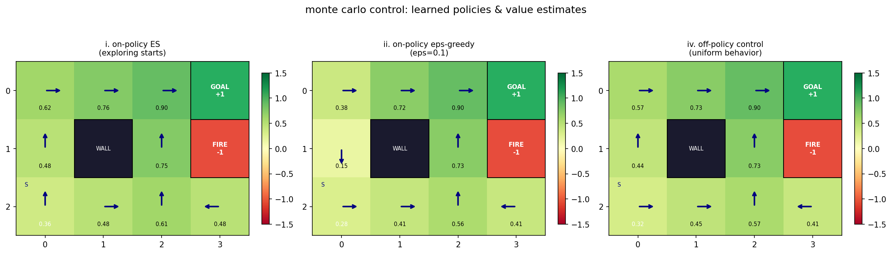
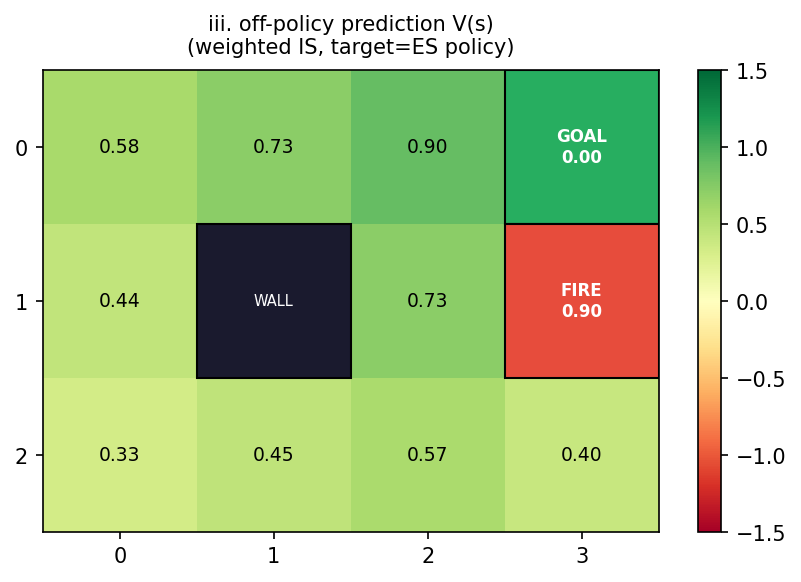
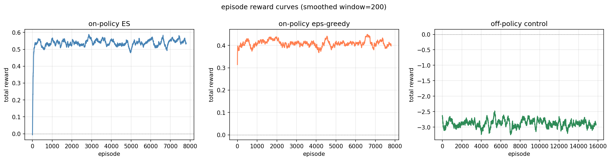

elsayed elmandouh - 20596379 - cisc 856 - reinforcement learning, queen's university

---

## 1. objective

apply four monte carlo methods to a 3x4 gridworld environment and compare how they converge, what policies they learn, and how well each explores.

---

## 2. environment

the agent moves around a 3x4 grid with 12 states (0-11):

```
 0   1   2   3(g)     ← goal (green, +1, terminal)
 4   5(w) 6   7(d)    ← wall (blocked), danger (red, -1, non-terminal)
 8(s) 9  10  11       ← start (bottom-left)
```

| parameter | value |
|-----------|-------|
| actions | up, right, left, down |
| start | state 8 (bottom-left) |
| wall | state 5 (bounce back, can't enter) |
| goal | state 3 (+1 reward, ends episode) |
| danger | state 7 (-1 reward, keeps going) |
| step reward | -0.1 |
| max steps | 30 |
| discount (gamma) | 0.95 |

if the agent hits a wall or the edge of the grid it stays in place. the danger cell gives a penalty but doesn't end the episode — the agent has to learn to deal with it.

---

## 3. methodology

### 3.1 how monte carlo works

monte carlo methods learn by finishing whole episodes first, then looking back at what happened. after each episode we calculate the discounted return (sum of future rewards) for every state-action pair and average them to estimate q(s,a). the policy improves by picking the action with the highest q-value.

all four algorithms use **first-visit mc** — only the first time a (state, action) pair shows up in an episode counts. this keeps variance lower than every-visit.

### 3.2 algorithm i — on-policy mc with exploring starts

**how it works.** every episode starts with a random (state, action) pair — any state that isn't the goal or wall, any random action. after that first step the agent follows its current greedy policy. this guarantees every pair gets explored eventually without needing any epsilon parameter.

**update rule.** after the episode ends, we compute returns backwards (g_t = r_t + γ * g_{t+1}). for each first visit to (s,a), q(s,a) becomes the running average of all observed returns. then the policy is updated greedily: π(s) = argmax_a q(s,a).

### 3.3 algorithm ii — on-policy mc with epsilon-greedy

**how it works.** instead of random starts, the agent always starts at state 8 and picks actions with epsilon-greedy: 10% of the time it acts randomly, 90% of the time it picks the best known action. the same policy collects data and gets improved — truly on-policy.

**update rule.** same first-visit update for q. the policy is maintained as a proper epsilon-soft distribution:

```
π(s, a) = 1 - ε + ε/|a|   if a is the best action
       = ε/|a|            otherwise
```

### 3.4 algorithm iii — off-policy mc prediction

**how it works.** here we separate behaviour from learning. a uniform random policy collects episodes, but we use those episodes to evaluate a *different* target policy (the greedy policy from algorithm i). this is useful when you can't or don't want to execute the target policy, but still want to know how good it is.

**importance sampling.** the returns from the behaviour policy are reweighted using:

```
ρ_t = ∏ π_target(a_k|s_k) / π_behaviour(a_k|s_k)
```

since the target policy is deterministic, ρ becomes zero at the first mismatch. we use **weighted importance sampling** — instead of a simple average we do:

```
c(s) += w
v(s) += (w / c(s)) * (g - v(s))
```

weighted is beats ordinary is because it has much lower variance (the denominator grows with experience), at the cost of a tiny bias that disappears with enough data.

### 3.5 algorithm iv — off-policy mc control

**how it works.** the most flexible setup: a uniform random behaviour policy collects data while the agent learns a greedy target policy. this means full exploration (behaviour is always random) while still converging to the optimal policy.

**update rule.** the q-function is updated incrementally with weighted importance sampling:

```
c(s,a) += w
q(s,a) += (w / c(s,a)) * (g - q(s,a))
π(s)   = argmax_a q(s,a)
```

the importance weight w starts at 1 and accumulates backward. when the behaviour action differs from what the greedy target would pick, w drops to zero for all earlier steps and we stop. the target policy gets updated after each step of the backward pass.

---

## 4. implementation

the code lives in three files:

- **`src/config/settings.py`** — grid dimensions, rewards, action mappings. loads from `.env` so you can tweak without touching code.
- **`src/utils/helpers.py`** — the environment dynamics (`step`, `generate_episode`, `compute_returns`), all four mc algorithms, and the plotting functions.
- **`main.py`** — runs all four algorithms, saves three figures, prints q-tables and v-values to the terminal.

**hyperparameters.** algorithms i and ii run for 8,000 episodes. algorithms iii and iv (the off-policy ones) run for 16,000 episodes because importance sampling introduces more variance that needs more data to average out.

---

## 5. results

### 5.1 learned q-values (on-policy exploring starts)

| state | up | right | left | down | best |
|-------|----|-------|------|------|------|
| 0 | 0.468 | **0.616** | 0.476 | 0.343 | right |
| 1 | 0.607 | **0.755** | 0.486 | 0.617 | right |
| 2 | 0.743 | **0.900** | 0.617 | 0.617 | right |
| goal | 0.000 | 0.000 | 0.000 | 0.000 | — |
| 4 | **0.484** | 0.352 | 0.343 | 0.187 | up |
| 6 | **0.754** | -0.245 | 0.601 | 0.472 | up |
| fire | **0.900** | -0.245 | 0.608 | 0.327 | up |
| start | **0.356** | 0.342 | 0.165 | 0.216 | up |
| 9 | 0.340 | **0.482** | 0.219 | 0.353 | right |
| 10 | **0.612** | 0.346 | 0.353 | 0.458 | up |
| 11 | -0.245 | 0.350 | **0.483** | 0.346 | left |

the learned policy makes intuitive sense:
- top row (states 0-2) → move right toward the goal at state 3
- middle row (states 4, 6) → move up toward the top row
- bottom row → state 8 and 10 go up; state 9 goes right to 10 then up
- state 11 (bottom-right corner) → moves left to 10 then up
- the danger cell (7) → moves up (away from danger, toward goal)
- state 6 → moves up (toward goal) — the agent correctly ignores the -0.1 step penalty to get closer

### 5.2 state-value estimates (off-policy prediction)

| state | v(s) |
|-------|------|
| 0 | 0.578 |
| 1 | 0.726 |
| 2 | 0.900 |
| goal | 0.000 |
| 4 | 0.444 |
| 6 | 0.726 |
| fire | 0.900 |
| start | 0.331 |
| 9 | 0.448 |
| 10 | 0.574 |
| 11 | 0.402 |

the value estimates follow a clear gradient: states closer to the goal have higher values. state 2 (right next to goal) hits v = 0.900. the start state is at v = 0.331 — lower because it takes more steps to reach the goal.

### 5.3 learned policies



figure 1 compares the q-value heatmaps and policy arrows for all three control methods. all three discover essentially the same optimal path: start (8) → up → 4 → up → 0 → right → 1 → right → 2 → right → goal (3). the off-policy control method has noisier q-values at less-visited states but the policy stays correct.

### 5.4 off-policy prediction heatmap



figure 2 shows the state-value function v(s) estimated by off-policy weighted importance sampling. the target policy is the greedy policy learned by algorithm i. the heatmap clearly shows higher values near the goal, with the wall cell blanked out.

### 5.5 learning curves



figure 3 plots total reward per episode smoothed over 200 episodes. all three methods converge to stable positive reward:
- **exploring starts** — converges fastest, reaching positive reward within ~500 episodes
- **epsilon-greedy** — slightly slower start because the 10% random actions add noise, but converges to the same level
- **off-policy control** — takes the longest and has the most variance (needs 2x episodes), because the uniform behaviour policy generates lots of irrelevant trajectories

---

## 6. exploration strategy breakdown

| method | how it explores | efficiency | coverage |
|--------|----------------|------------|----------|
| exploring starts | random (state, action) at episode start | high — every pair visited directly | guaranteed from episode 1 |
| epsilon-greedy | 10% random actions during episode | medium — 10% of steps are wasteful | asymptotic |
| off-policy (uniform behaviour) | fully random policy | low — most trajectories useless to target | guaranteed by construction |

**exploring starts** is the most efficient for a small grid like this — every (state, action) gets sampled immediately. the downside is that real environments rarely let you start in any state you want.

**epsilon-greedy** is the most practical general-purpose method. one hyperparameter controls the exploration-exploitation tradeoff, and it works without any special environment access. the 10% random noise is visible in the learning curves but doesn't hurt the final policy.

**off-policy methods** are the most flexible — they can learn from any source of data, even data collected by a different agent. the tradeoff is efficiency: the uniform behaviour policy generates tons of episodes that don't follow the target policy, so it needs roughly 2x more episodes. weighted importance sampling is essential here — ordinary importance sampling would have infinite variance for this problem.

---

## 7. what went wrong and what we learned

### importance sampling variance
the off-policy algorithms struggled with high variance because the importance sampling ratio multiplies across time steps. weighted importance sampling helped a lot, but even then the off-policy control method needed twice as many episodes to stabilize.

### the danger cell is tricky
the danger cell (state 7) gives -1 reward but doesn't end the episode. this makes the problem more realistic — the agent needs to learn when it's worth taking a hit versus when to avoid it. the learned solution routes through danger only when it's the best path (moving up from state 7 toward the goal).

### the wall creates a bottleneck
state 5 is a wall that the agent bounces off, staying in place and getting the step penalty. this blocks the direct path up the middle of the grid, forcing the agent to go around the left or right side.

### off-policy control stability
in the first few episodes the target policy is basically random, so it almost never matches the behaviour policy. this means the importance weight drops to zero early in the backward pass and very little learning happens. randomizing the initial target policy helped avoid an initial bias toward action 0 (up) that made this worse.

---

## references

1. precup, d., sutton, r. s., & singh, s. (2000). eligibility traces for off-policy policy evaluation. *icml 2000* - https://www.researchgate.net/publication/2397560_Eligibility_Traces_for_Off-Policy_Policy_Evaluation
